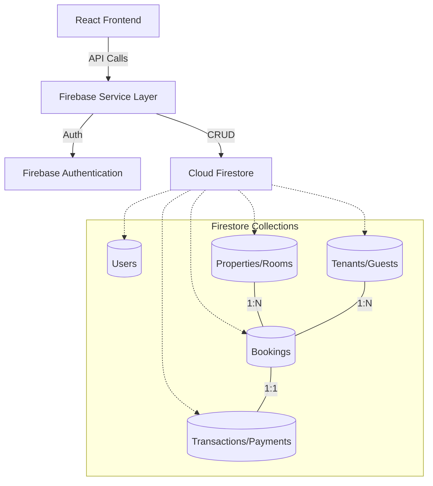

# Firebase API Diagram

```mermaid
graph TD
    Client[React Frontend] -->|API Calls| Service[Firebase Service Layer]
    Service -->|Auth| FirebaseAuth[Firebase Authentication]
    Service -->|CRUD| Firestore[Cloud Firestore]
    
    subgraph Firestore Collections
        Users[(Users)]
        Properties[(Properties/Rooms)]
        Tenants[(Tenants/Guests)]
        Bookings[(Bookings)]
        Transactions[(Transactions/Payments)]
    end
    
    Firestore -.-> Users
    Firestore -.-> Properties
    Firestore -.-> Tenants
    Firestore -.-> Bookings
    Firestore -.-> Transactions
    
    Properties ---|1:N| Bookings
    Tenants ---|1:N| Bookings
    Bookings ---|1:1| Transactions
```
